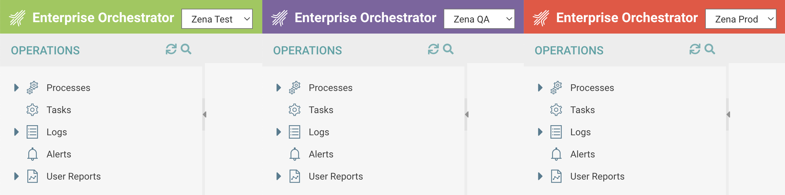

  <h2 align="center">Rocket Zena Platform Enhancer</h3>

  

   A Chrome extension to improve <a href="https://www.rocketsoftware.com/products/rocket-workload-automation-and-orchestration/rocket-zena">ASG/Rocket Zena Orchestrator</a>.
    
    
   
  

## Features
- Psudeo Dark Mode (inverts the colors of the webpage)
- Environment Switcher (quickly switch between Test, QA and Prod)
  * (Hold the Control or Command key while switching to open in a new tab)
- Colorized Headers to Match environments (Green in Test, Purple in QA, Red in Prod)
- Auto-Expand collapsable components (utilized in Process Reporting)
- Disable "Save Before Exiting" Prompt
- Enable multi-line editing of variables in the Operations view
  * (Limited to Zena version 4.3.1.61)

Have a feature suggestion? [Open an issue](https://github.com/matt-flaig/Rocket-Zena-Enhancer/issues/new).

## Installing This Extension
This extension is published to the [Chrome Web Store](https://chrome.google.com/webstore/detail/zena-platform-enhancer/phimdobecbpjafnibopanckafpipakab) and can be downloaded for Google Chrome and Microsoft Edge browsers.

### Manual Installation (Load Unpacked)

In Chrome, visit the url **chrome://extensions**

Enable **Developer Mode** by toggling the switch on the top right corner of the page.

Click on **Load unpacked** button, select the `src` folder from this repo (which contains this extension), and click on "Select Folder".

## Using This Extension in Your Own Zena Instance
This plugin was developed around a specific Rocket Zena environment, if you're interested in using this extension in your own environment there are a few changes you'll need to make.

- Reconfigure the `matches` array values in the `src/manifest.json` file to match your own installation URL.
- Adjust the environment logic (found in src/library/js/app.js) to correctly detect each of your own environments.
